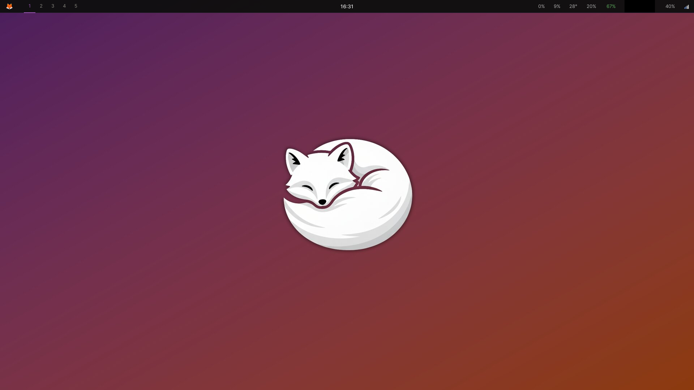
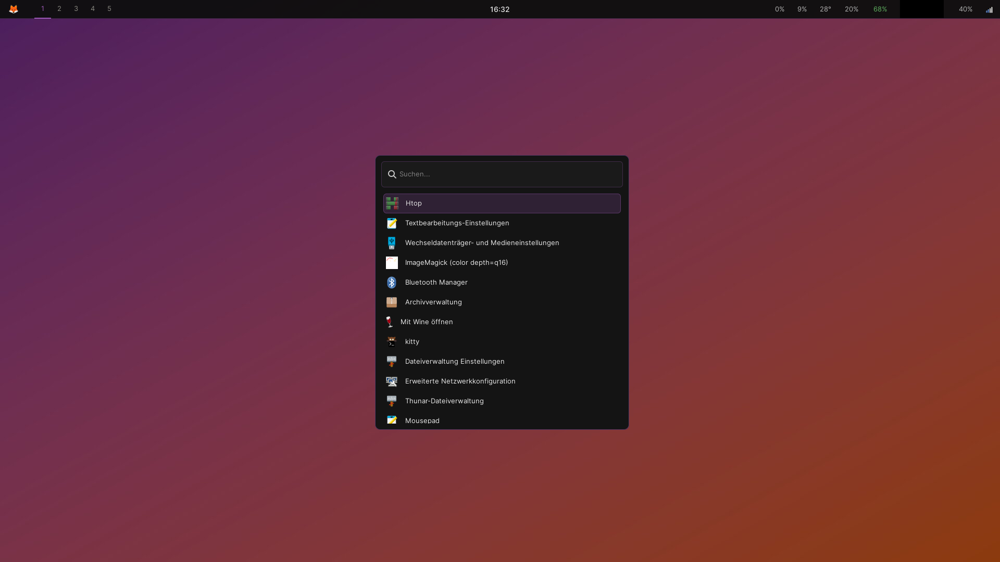

<div align="center">


</div>

# SnowFoxOS v2.0

<div align="center">

**A lightweight, performance-focused Wayland desktop built on Debian 12**


</div>

---

## Overview

SnowFoxOS is a one-script installer that transforms a minimal Debian 12 installation into a controlled, performance-focused Wayland desktop. No bloat, no display manager, no unnecessary services — just a clean Sway environment unified around a single CLI tool: `snowfox`.

The `snowfox` command is the heart of the system. It manages everything from system status and GPU switching to hardware kill switches, media streaming, and an offline AI — all from one place, all running locally.



---

## Philosophy

Most operating systems treat you as a product. They collect your data, slow down your hardware with every update, and lock you into ecosystems you never agreed to.

SnowFoxOS is built on a different belief:

> *Your computer belongs to you. Not to Microsoft. Not to anyone else.*
> *No telemetry or background data collection. No ads. No subscriptions.*
> *You are not a product. You are not data. You are a person.*
>
> — Alexander Valentin Ludwig

This system is for people who want their hardware back. It runs well on machines that Windows has abandoned. It does not phone home. It does not get slower with updates. It does not sell your attention.

---

## Features

- **Sway** — tiling Wayland compositor with smart gaps and per-window floating rules
- **Waybar** — status bar with CPU, RAM, battery, network and audio
- **Wofi** — fast app launcher and network manager with a matching dark theme
- **Kitty** — GPU-accelerated terminal
- **Brave** — privacy-focused browser, Firefox not included by design
- **PipeWire** — modern audio stack, PulseAudio removed
- **Dunst** — lightweight notification daemon
- **zram** — compressed swap in RAM (lz4, 50%), swappiness tuned to 10
- **tlp** — automatic battery optimization, active on every boot
- **wlsunset** — automatic blue light reduction based on time of day
- **GPU auto-detection** — installs the right drivers for AMD, Nvidia, or hybrid setups automatically
- **Dark mode** — GTK3 + GTK4 Adwaita-dark out of the box



---

## Performance

SnowFoxOS is tuned to stay out of the way and use as little resources as possible.

- zram with lz4 compression replaces traditional swap — faster and RAM-efficient
- `vm.swappiness=10` keeps data in RAM as long as possible
- `tlp` optimizes CPU, USB, and disk power management automatically
- Unnecessary system services are disabled on install (cups, avahi, ModemManager, and more)
- No display manager — Sway starts directly from TTY1
- **~700MB idle RAM** — for a full modern Wayland desktop including audio, networking, and compositor

The following comparison reflects approximate values for typical default setups:

| System | Idle RAM (approx.) |
|---|---|
| Windows 11 | ~3.5GB |
| Ubuntu (GNOME) | ~1.5GB |
| KDE Plasma | ~900MB |
| SnowFoxOS | ~700MB |


---

## snowfox CLI

`snowfox` is the central control interface of SnowFoxOS. Instead of scattered tools and settings menus, everything is accessible through one unified command — designed to be fast, transparent, and local.

### System

| Command | Description |
|---|---|
| `snowfox status` | RAM, disk, uptime, GPU mode, mic/cam status, active profile |
| `snowfox battery` | Battery level, power draw, estimated runtime, health |
| `snowfox profile [name]` | Switch system profile: balanced, performance, battery, privacy |
| `snowfox update` | System update including yt-dlp |
| `snowfox gpu` | Switch GPU mode (hybrid systems only) |
| `snowfox audit` | Active network connections with process and destination IP |
| `snowfox autostart [list\|enable\|disable]` | Manage autostart programs |

### Privacy & Hardware

| Command | Description |
|---|---|
| `snowfox airmode on/off` | Disable all wireless interfaces — WiFi, Bluetooth, everything |
| `snowfox kill mic/cam/all` | Disable microphone or camera at kernel level |
| `snowfox pass` | Local encrypted password manager — no cloud, no sync |
| `snowfox tip` | Random security tip — digital and real life |

### Media

| Command | Description |
|---|---|
| `snowfox stream <URL>` | Stream directly in mpv — no browser, no tracking |
| `snowfox download <URL>` | Download video or audio from 1000+ sites |

### Other

| Command | Description |
|---|---|
| `snowfox network` | Network manager via Wofi — including captive portal support |
| `snowfox ai` | Offline AI that knows your system |
| `snowfox help` | Show all commands |

### System Profiles

`snowfox profile` switches between four modes instantly:

| Profile | CPU | swappiness | wlsunset | Network |
|---|---|---|---|---|
| `balanced` | schedutil | 10 | on | on |
| `performance` | performance | 10 | off | on |
| `battery` | powersave | 60 | on | on |
| `privacy` | schedutil | 10 | off | all off |

### Why `snowfox stream`?

You could open YouTube in a browser. But every time you do, Google tracks what you watch, how long, and what you do next. The algorithm is designed to keep you watching.

`snowfox stream` plays any URL directly in mpv — no JavaScript, no tracking, no recommendations, no autoplay. Just the video. It works with YouTube, Twitch, SoundCloud, Vimeo, TikTok, and over 1000 other sites.

Your attention belongs to you.

### Offline AI

SnowFoxOS includes an optional offline AI powered by Ollama and llama3.2. It runs entirely on your machine — no cloud, no data leaving your device. It knows SnowFoxOS: your shortcuts, your tools, your commands, your philosophy. Ask it anything about your system, or just talk.

---

## Installation

**Requirements:** A fresh Debian 12 (Bookworm) minimal install with a non-root user.

```bash
git clone https://github.com/Xr7-Code/SnowFoxOS-v2.git
cd SnowFoxOS-v2
sudo ./install.sh
sudo reboot
```

After reboot, log in at TTY1 — Sway starts automatically.

---

## Keyboard Shortcuts

| Shortcut | Action |
|---|---|
| `Super + Return` | Terminal (Kitty) |
| `Super + Space` | App launcher (Wofi) |
| `Super + B` | Brave Browser |
| `Super + E` | File manager (Thunar) |
| `Super + N` | Network manager (Wofi) |
| `Super + L` | Lock screen |
| `Super + Q` | Close window |
| `Super + F` | Toggle fullscreen |
| `Super + Shift + 1-5` | Move window to workspace |
| `Super + Shift + E` | Power menu |
| `Super + Shift + R` | Reload Sway config |
| `Print` | Screenshot |
| `Super + Print` | Area screenshot |

---

## Stack

| Component | Package |
|---|---|
| Compositor | sway |
| Status bar | waybar |
| App launcher | wofi |
| Terminal | kitty |
| Browser | brave |
| Audio | pipewire + wireplumber |
| Notifications | dunst |
| File manager | thunar |
| Screen lock | swaylock |
| Idle manager | swayidle |
| Media player | mpv + yt-dlp |
| Battery | tlp |
| Blue light | wlsunset |
| Offline AI | ollama + llama3.2 |

---

## Screenshots

Screenshots were taken with `grim` — already included in the installation.

```bash
# Full screenshot
grim ~/Pictures/screenshot.png

# Area selection
grim -g "$(slurp)" ~/Pictures/screenshot.png
```

---

## License

SnowFoxOS is released under the **SnowFox Public License (SFL) v1.1** — a custom license built on the belief that software should serve people, not exploit them. See [LICENSE](LICENSE) for details.

---

<div align="center">
<sub>Built by Alexander Valentin Ludwig (Xr7-Code) on Debian 12</sub>
</div>
