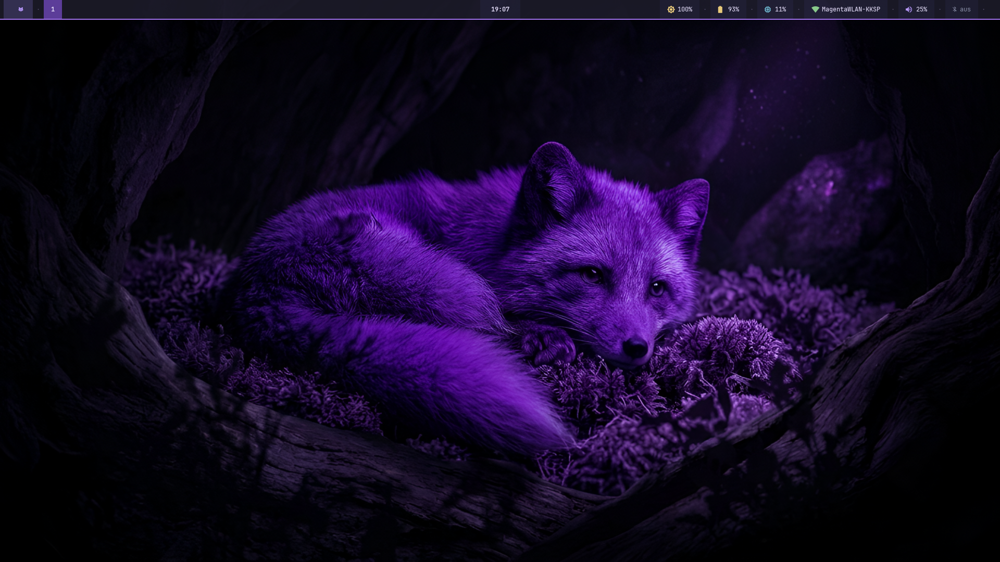
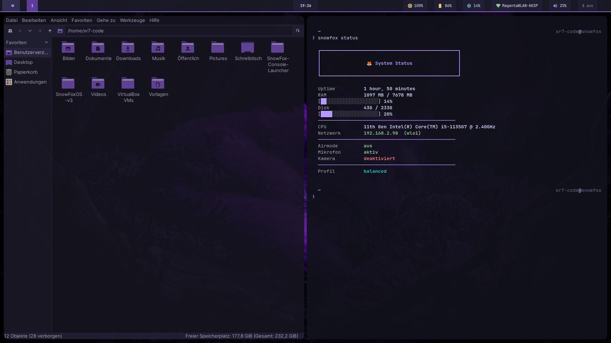
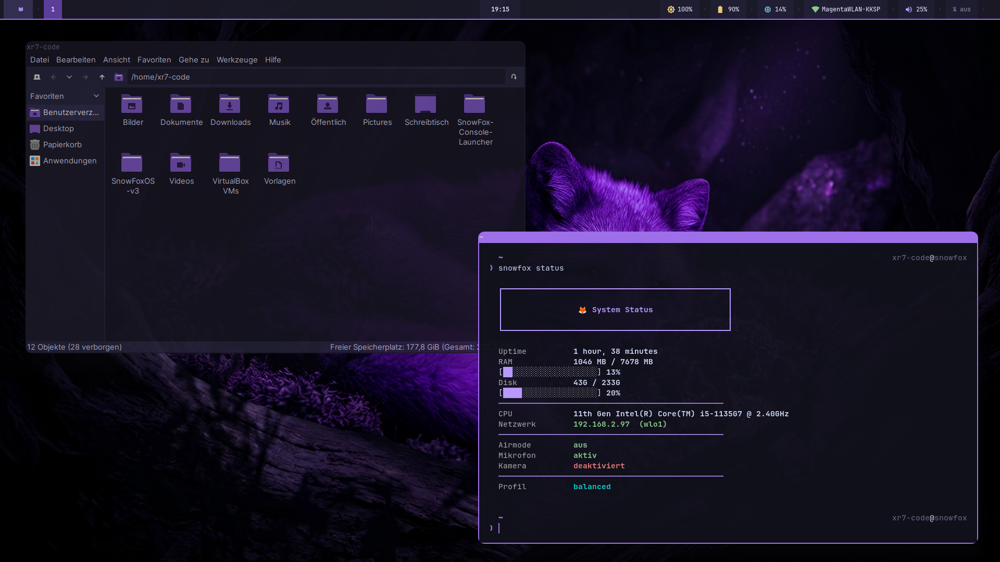
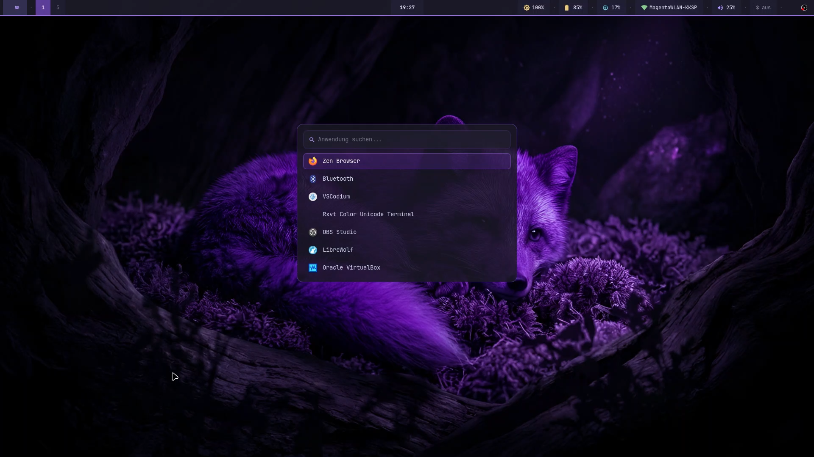

<div align="center">


# SnowFoxOS v3

**Ein schlankes, privacy-orientiertes i3-Desktop auf Basis von Debian 12**


</div>

---

## Was ist SnowFoxOS?

SnowFoxOS ist ein Ein-Script-Installer der eine minimale Debian 12 Netinstall-Installation in einen konfigurierten i3-Desktop verwandelt. Es ist kein eigenes Betriebssystem — es ist Debian 12 mit einem durchdachten, privacy-fokussierten Setup das sonst Stunden manueller Konfiguration erfordert.

Der Installer richtet rund 10 Schritte automatisch ein: Kernel, Treiber, Desktop-Umgebung, Sicherheitskonfiguration, CLI-Tools. Das Ergebnis ist ein System das sofort nutzbar ist und bei dem die wichtigsten Privacy- und Performance-Einstellungen bereits aktiv sind.

**Was SnowFoxOS nicht ist:** Ein Hochsicherheitssystem. Wer Schutz vor staatlichen Akteuren oder aktiven Angreifern braucht, sollte Tails oder Whonix verwenden.

---

## Screenshots

<div align="center">

**Desktop**




**Tiling**




**Floating**




**Rofi App-Launcher**




</div>

---

## Warum dieses Projekt?

Die meisten Desktop-Linux-Setups sind entweder zu komplex für Einsteiger oder zu kompromissbereit bei Privacy und Performance. SnowFoxOS versucht einen dritten Weg: ein System das out-of-the-box sinnvoll konfiguriert ist, ohne dass der Nutzer verstehen muss warum.

Die Grundüberzeugung dahinter: ein Computer sollte dem Nutzer gehören — nicht den Diensten die er nutzt. Das bedeutet konkret keine Telemetrie, kein Tracking, keine Abhängigkeit von Cloud-Diensten für grundlegende Funktionen.

> *Dein Computer gehört dir. Nicht Microsoft. Niemandem sonst.*
> — Alexander Valentin Ludwig

Das ist eine persönliche Überzeugung, kein Versprechen. Ob SnowFoxOS das für dich erfüllt, kannst du mit den unten beschriebenen Mitteln selbst prüfen.

---

## Sicherheit & Privacy

### Was SnowFoxOS konkret tut

**Kernel-Härtung** — folgende sysctl-Werte werden in `/etc/sysctl.d/99-snowfox-security.conf` gesetzt:

```
kernel.kptr_restrict=2              # Kernel-Pointer vor Userspace verstecken
kernel.perf_event_paranoid=3        # Performance-Events einschränken
kernel.unprivileged_bpf_disabled=1  # BPF nur für root
net.core.bpf_jit_harden=2          # JIT-Spray-Schutz
kernel.dmesg_restrict=1             # dmesg nur für root
fs.protected_hardlinks=1            # Hardlink-Angriffe verhindern
fs.protected_symlinks=1             # Symlink-Angriffe verhindern
kernel.core_uses_pid=1              # Core Dumps mit PID
fs.suid_dumpable=0                  # Keine Core Dumps für SUID-Programme
```

**Netzwerk-Härtung** — in `/etc/sysctl.d/99-snowfox.conf`:

```
net.ipv4.conf.all.rp_filter=1               # Reverse Path Filtering
net.ipv4.conf.all.accept_redirects=0        # ICMP-Redirects ablehnen
net.ipv4.tcp_syncookies=1                   # SYN-Flood-Schutz
net.ipv6.conf.all.use_tempaddr=2            # IPv6 Privacy Extensions
net.core.default_qdisc=fq                  # Fair Queuing
net.ipv4.tcp_congestion_control=bbr        # BBR Congestion Control
```

**DNS-over-TLS** — `/etc/systemd/resolved.conf` wird so konfiguriert dass alle DNS-Anfragen verschlüsselt über Cloudflare (1.1.1.1) und Quad9 (9.9.9.9) laufen. Verifizieren mit:

```bash
resolvectl status
# Zeigt: DNS over TLS: yes
```

**Firewall** — UFW mit default-deny eingehend, default-allow ausgehend. SSH wird deaktiviert und aus UFW entfernt. Prüfen mit:

```bash
sudo ufw status verbose
```

**SSH deaktiviert:**

```bash
systemctl is-enabled ssh
# Ausgabe: disabled
```

### Was du selbst prüfen kannst

Aktive Netzwerkverbindungen anzeigen:
```bash
snowfox audit
# Oder direkt:
ss -tulpn
```

DNS-Leak-Test:
```bash
# Tor-Modus aktivieren, dann:
curl https://icanhazip.com
# Sollte Tor-Exit-IP zeigen, nicht deine echte IP
```

Kernel-Parameter prüfen:
```bash
sysctl kernel.kptr_restrict
sysctl net.core.bpf_jit_harden
```

### Grenzen — was SnowFoxOS nicht schützt

**X11 ist strukturell unsicher.** Jede laufende Anwendung kann unter X11 den Bildschirminhalt aller anderen Anwendungen lesen und Tastatureingaben abfangen — ohne Root-Rechte. Das ist kein SnowFoxOS-Problem sondern ein fundamentales X11-Problem. Wer das vermeiden will braucht Wayland.

**Kein AppArmor oder SELinux.** Prozesse laufen ohne Mandatory Access Control. Ein kompromittierter Prozess hat volle Benutzerrechte im eigenen Home-Verzeichnis.

**`snowfox pass` ist kein Passwort-Manager.** Es ist eine GPG-verschlüsselte Textdatei — ohne Clipboard-Clearing, ohne Brute-Force-Schutz, ohne Memory-Protection. Für sensible Passwörter: KeePassXC oder `pass`.

**Keine automatischen Sicherheitsupdates.** `snowfox update` muss manuell ausgeführt werden.

---

## Performance

### RAM-Messung

Die folgende Messung wurde mit `smem` auf einem HP 250 G8 (Intel i5-1135G7, 8GB RAM) durchgeführt, direkt nach dem Start ohne offene Anwendungen außer dem Desktop-Stack:

```bash
smem -tk -s pss -r | tail -1
# Ergebnis: ~177 MB PSS (Proportional Set Size)
```

PSS ist die genaueste Methode — shared Libraries werden anteilig gezählt statt doppelt. Der Wert aus `free -h` ist höher weil er Page-Cache einschließt, der bei Bedarf sofort freigegeben wird.

**Laufende Prozesse bei der Messung:** Xorg, i3, polybar, picom, pipewire, wireplumber, dunst, lxpolkit, xsettingsd, nm-applet, clip-saver, xss-lock, dbus

| Zustand | RAM (PSS) |
|---|---|
| Desktop-Stack idle | ~177 MB |
| + Kitty Terminal | ~200 MB |
| + Zen Browser (5 Tabs) | ~900 MB – 1,3 GB |
| + Zen Browser (viele Tabs) | 1,5–2,5 GB |
| + OnlyOffice | +500 MB |
| + Steam im Hintergrund | +300 MB |

Zum Vergleich (Community-Benchmarks, `free -h` `used`-Wert — nicht direkt vergleichbar mit PSS):

| System | Idle RAM |
|---|---|
| Windows 11 | ~3,5 GB |
| Ubuntu (GNOME) | ~1,5 GB |
| KDE Plasma | ~900 MB |
| Arch Linux mit i3 | ~400–500 MB |
| **SnowFoxOS (PSS)** | **~177 MB** |

> Die Vergleichswerte für andere Systeme stammen aus Community-Benchmarks und nutzen `free -h` — eine andere Messmethode als PSS. Ein direkter Vergleich ist daher nur eingeschränkt möglich. Was sicher gesagt werden kann: SnowFoxOS ist ein schlankes System.

### Was Performance konkret bedeutet

**zram** ersetzt traditionellen Swap — komprimierter Swap im RAM mit lz4, 50% RAM-Größe, `PRIORITY=100`. `vm.swappiness=10` hält Daten so lange wie möglich im RAM.

**Kein Display Manager** — i3 startet direkt von TTY1, kein GDM/LightDM im Hintergrund.

**Deaktivierte Dienste** beim Installer: `cups-browsed`, `avahi-daemon`, `ModemManager`, `colord`, `apt-daily`, `apt-daily-upgrade`, `NetworkManager-wait-online`.

**`fstab` mit `noatime`** — keine Zugriffszeitstempel schreiben, reduziert Disk-I/O.

---

## Features

- **i3 WM mit Smart Dynamic Floating** — Tiling Window Manager mit Smart Gaps. Floating-Fenster erhalten automatisch Titelleiste, lila Rahmen, feste Größe (`960x600`) und Zentrierung. Zurück zu Tiling: alles wird automatisch entfernt.
- **Polybar** — Statusleiste mit RAM, Akku, Netzwerk, Lautstärke, Bluetooth und System-Tray
- **Rofi** — App-Launcher mit SnowFox-Theme
- **Kitty** — GPU-beschleunigtes Terminal mit SnowFox-Farbpalette, JetBrainsMono Nerd Font, 0.95 Transparenz
- **Starship** — moderner Shell-Prompt mit Git-Integration und SnowFox-Palette
- **picom** — Compositor mit runden Ecken, weichen Schatten, Fading-Animationen
- **Zen Browser** — privacy-fokussierter Browser auf Firefox-Basis (optional)
- **PipeWire** — moderner Audio-Stack mit WirePlumber
- **Dunst** — Notification-Daemon, abgestimmt auf die SnowFox-Palette
- **Clip-Saver** — hält Clipboard-Inhalte aktiv auch nach dem Schließen des Quellfensters (`clipnotify` + `xclip`, kein History-Bloat)
- **fastfetch** — Systeminfo mit SnowFox-Logo
- **zram** — komprimierter Swap im RAM (lz4, 50%)
- **tlp** — Akku-Optimierung für Laptops
- **earlyoom** — OOM-Schutz gegen System-Freeze
- **ufw** — Firewall, default-deny eingehend
- **DNS-over-TLS** — via systemd-resolved, Cloudflare + Quad9
- **GPU-Erkennung** — automatische Treiber-Installation für AMD, NVIDIA, Intel, Hybrid
- **Automatischer Kernel-Fallback** — XanMod LTS (x64v3) auf modernen CPUs, Standard-Debian-Kernel als Fallback wenn kein AVX2
- **Hybrid GPU Freeze Fix** — PSR-Deaktivierung für AMD+NVIDIA Dual-Monitor Setups
- **Dark Mode** — SnowFox Palette konsistent in GTK2/3/4 und Qt
- **OnlyOffice** — Microsoft-Format-Kompatibilität (optional)
- **SnowFox Console Launcher** — Game-Hub für Steam, GOG, Retro
- **Multiarch (i386)** — 32-Bit-Unterstützung für Steam und ältere Spiele
- **Smart Lock** — sperrt nicht wenn Video läuft oder Vollbild aktiv, geblurrtes Wallpaper als Hintergrund
- **Tor-Modus** — `snowfox tor on/off` mit DNS-Schutz, IPv6-Deaktivierung, MAC-Randomisierung
<!-- - **Mesh-Netzwerk** — P2P-Kommunikation via Reticulum ohne ISP (experimentell) -->
- **Ollama** — lokale KI-Engine
- **`yt-dlp`** — Video/Audio ohne Browser

---

## snowfox CLI

`snowfox` ist die zentrale Steuerung. Alle Funktionen sind über einen Befehl erreichbar.

### System

| Befehl | Beschreibung |
|---|---|
| `snowfox status` | RAM, Disk, Uptime, GPU-Modus, Mikro/Kamera-Status, Netzwerk |
| `snowfox battery` | Akkuladung, Energieverbrauch, geschätzte Laufzeit |
| `snowfox profile [name]` | Profil wechseln: balanced, performance, battery, privacy |
| `snowfox update` | System-Update inkl. yt-dlp |
| `snowfox audit` | Aktive Netzwerkverbindungen mit Prozess und Ziel-IP |

### Privacy & Hardware

| Befehl | Beschreibung |
|---|---|
| `snowfox tor on/off` | Tor-Modus mit DNS-Schutz und MAC-Randomisierung |
| `snowfox airmode on/off` | Alle Funkschnittstellen deaktivieren |
| `snowfox kill mic` | Mikrofon auf Kernel-Ebene deaktivieren |
| `snowfox kill cam` | Webcam deaktivieren |
| `snowfox kill all` | Mikrofon + Kamera + Funk auf einmal |
| `snowfox kill restore` | Alle Kill-Switches zurücksetzen |
| `snowfox pass` | Lokaler GPG-verschlüsselter Passwort-Speicher |

### Media

| Befehl | Beschreibung |
|---|---|
| `snowfox stream [Suche/URL]` | Video/Audio direkt in mpv streamen — kein Browser, kein Tracking |
| `snowfox download [Suche/URL]` | Video oder Audio herunterladen |
| `snowfox fetch <URL>` | Highspeed-Download über 16 parallele Verbindungen |

### Tools

| Befehl | Beschreibung |
|---|---|
| `snowfox autostart [list\|enable\|disable]` | Autostart verwalten |
| `snowfox layout [tiling\|floating]` | Fenstermodus wechseln |
| `snowfox webapp [add\|list\|open\|remove]` | WebApps verwalten |
| `snowfox network` | Netzwerk-Manager (nmtui) |
| `snowfox ai` | Lokale KI (Ollama) |
<!-- | `snowfox mesh` | P2P-Mesh-Netzwerk (Reticulum) | -->

### Node-Modi

| Befehl | Beschreibung |
|---|---|
| `snowfox node console` | Game-Hub für Steam, GOG, Retro |
| `snowfox node server` | Server-Modus, minimaler Footprint |
| `snowfox node desktop` | Standard Desktop-Modus |

### System-Profile

| Profil | CPU-Governor | Swappiness | Netzwerk |
|---|---|---|---|
| `balanced` | schedutil | 10 | an |
| `performance` | performance | 10 | an |
| `battery` | powersave | 60 | an |
| `privacy` | schedutil | 10 | alles aus |

### System Reset

| Befehl | Beschreibung |
|---|---|
| `snowfox reset` | Setzt auf Debian-Minimalzustand zurück — löscht alle Daten |

---

## Installation

**Voraussetzung:** Frische **Debian 12 (Bookworm) minimal Installation** mit einem normalen (nicht-root) Benutzer. Nur Debian 12 wird unterstützt — Ubuntu, Mint, Kali und Derivate funktionieren nicht.

### Schritt 1 — Debian 12 minimal installieren

ISO herunterladen: [debian.org/distrib/netinst](https://www.debian.org/distrib/netinst/)

Bei der Software-Auswahl **alles abwählen** — auch den Desktop. Nur „Standard-Systemwerkzeuge" oder komplett leer lassen.

### Schritt 2 — Vorbereitung

```bash
su -
apt-get install -y sudo git
usermod -aG sudo DEINBENUTZERNAME
exit
exit
```

### Schritt 3 — Installieren

```bash
git clone https://github.com/Xr7-Code/SnowFoxOS-v3.git
cd SnowFoxOS-v3
chmod +x install.sh
sudo bash install.sh
```

Der Installer fragt bei optionalen Paketen nach. Dauer je nach Internetgeschwindigkeit **20–60 Minuten**.

### Schritt 4 — Neustart

```bash
sudo reboot
```

i3 startet automatisch von TTY1.

---

## Tastenkürzel

| Kürzel | Aktion |
|---|---|
| `Super + Return` | Terminal (Kitty) |
| `Super + Tab` | Fenster wechseln |
| `Super + Space` | App-Launcher (Rofi) |
| `Super + E` | Dateimanager (PCManFM) |
| `Super + N` | Netzwerk-Manager |
| `Super + W` | Wallpaper-Selector |
| `Super + P` | Display-Konfiguration |
| `Super + L` | Bildschirm sperren |
| `Super + Q` | Fenster schließen |
| `Super + F` | Vollbild umschalten |
| `Super + H / V` | Split horizontal / vertikal |
| `Super + Shift + Space` | Floating Toggle (Auto-Size, Auto-Border, Zentrierung) |
| `Super + 1–9` | Workspace wechseln |
| `Super + Shift + 1–9` | Fenster zu Workspace verschieben |
| `Super + R` | Resize-Modus |
| `Super + Shift + R` | i3 neu laden |
| `Super + Shift + E` | Power-Menü |
| `Print` | Screenshot |
| `Super + Print` | Bereich-Screenshot |

---

## Stack

| Komponente | Paket |
|---|---|
| Window Manager | i3 |
| Statusleiste | polybar |
| App-Launcher | rofi |
| Terminal | kitty |
| Shell-Prompt | starship |
| Browser | zen-browser (optional) |
| Audio | pipewire + wireplumber |
| Compositor | picom |
| Benachrichtigungen | dunst |
| Clipboard | clip-saver + clipnotify |
| Dateimanager | pcmanfm |
| System-Info | fastfetch |
| Bildschirmsperre | i3lock + xss-lock (Smart Lock) |
| Media Player | mpv + yt-dlp |
| Game Launcher | SnowFox Console Launcher |
| Office | OnlyOffice (optional) |
| Akku | tlp |
| Firewall | ufw |
| OOM-Schutz | earlyoom |
| Kernel | XanMod LTS (x64v3) mit Fallback |
| Bluetooth UI | bluetui |
| Cursor | Bibata-Modern-Classic |
| Night Light | redshift |
| Screenshot | scrot |
| Helligkeit | brightnessctl |
| Mediensteuerung | playerctl |
| Drucker | cups |
| GTK-Theme | Arc-Dark + SnowFox-Overrides |
| Thermal | thermald |

---

## Einschränkungen

### Hardware-Anforderungen

**XanMod-Kernel benötigt AVX2** — Intel Haswell (2013) oder neuer, AMD Excavator (2015) oder neuer. Der Installer erkennt das automatisch und fällt auf den Standard-Debian-Kernel zurück. Prüfen:

```bash
grep avx2 /proc/cpuinfo | head -1
```

**NVIDIA: Maxwell (2014) oder neuer** — GTX 750 / GTX 900-Serie und neuer, alle RTX-Generationen. Ältere Karten werden nicht unterstützt.

**AMD + NVIDIA Hybrid** — der PSR-Freeze-Fix wird automatisch angewendet. Bei Problemen: `amdgpu dcfeaturemask=0x8` in `/etc/modprobe.d/amdgpu.conf` prüfen.

### Bekannte Probleme

**Dual-Monitor Tray-Popups** können auf dem falschen Monitor erscheinen — bekanntes i3/GTK-Problem. Workaround: `Super + Mausklick` zum Verschieben.

**VirtualBox** injiziert Wayland-Variablen in die Umgebung was picom und andere X11-Tools stört. SnowFoxOS ist für echte Hardware ausgelegt, nicht für VMs.

**Nur Debian 12** — Ubuntu, Mint, Kali und andere Derivate werden nicht unterstützt.

---

## Lizenz

SnowFoxOS wird unter der **SnowFox Public License v1.0** veröffentlicht. Siehe [LICENSE](LICENSE).

---

<div align="center">
<sub>Gebaut von Alexander Valentin Ludwig (Xr7-Code) auf Debian 12</sub>
</div>

<!--
I know it's hard to tell how mixed up you feel
Hoping what you need is behind every door
Each time you get hurt, I don't want you to change
Because everyone has hopes, you're human after all
The feeling sometimes, wishing you were someone else
Feeling as though you never belong
This feeling is not sadness, this feeling is not joy
I truly understand. Please, don't cry now

Please don't go, I want you to stay
I'm begging you please, please don't leave here
I don't want you to hate;
For all the hurt that you feel,
The world is just illusion, trying to change you

Being like you are
Well this is something else, who would comprehend?
But some that do, lay claim
Divine purpose blesses them
That's not what I believe, and it doesn't matter anyway
A part of your soul ties you to the next world
Or maybe to the last, but I'm still not sure
But what I do know, is to us the world is different
As we are to the world but I guess you would know that

Please don't go, I want you to stay
I'm begging you please, please don't leave here
I don't want you to hate for all the hurt that you feel
The world is just illusion trying to change you
Please don't go, I want you to stay
I'm begging you please, oh please don't leave here
I don't want you to change;
For all the hurt that you feel,
This world is just illusion, always trying to change you

Please don't go, I want you to stay
I'm begging you please, please don't leave here
I don't want you to hate for all the hurt that you feel
The world is just illusion trying to change you
Please don't go, I want you to stay
I'm begging you please, oh please don't leave here
I don't want you to change;
For all the hurt that you feel,
This world is just illusion, always trying to change you
-->
